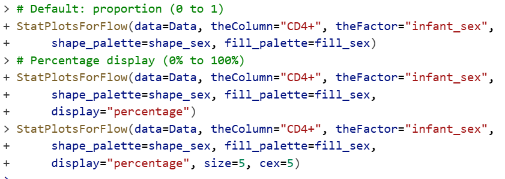
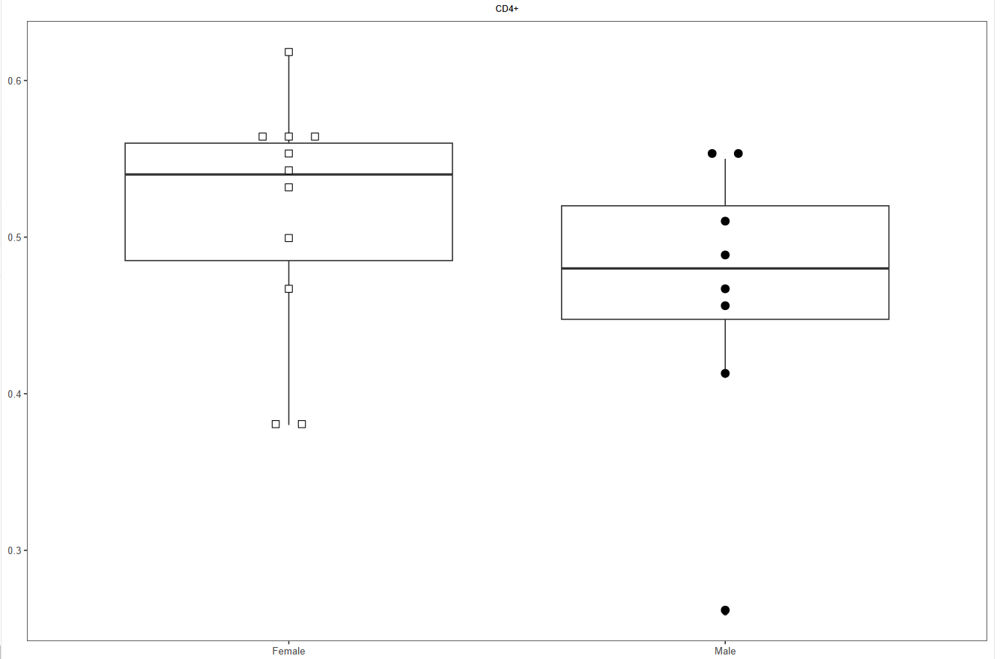
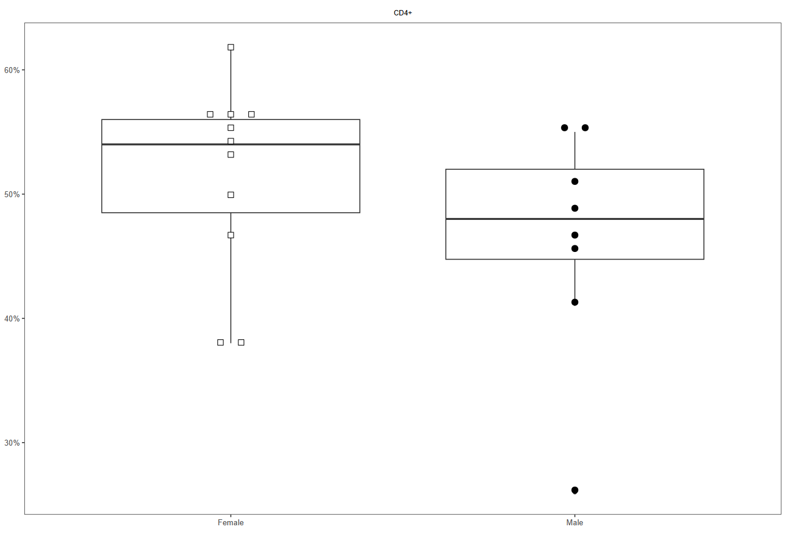
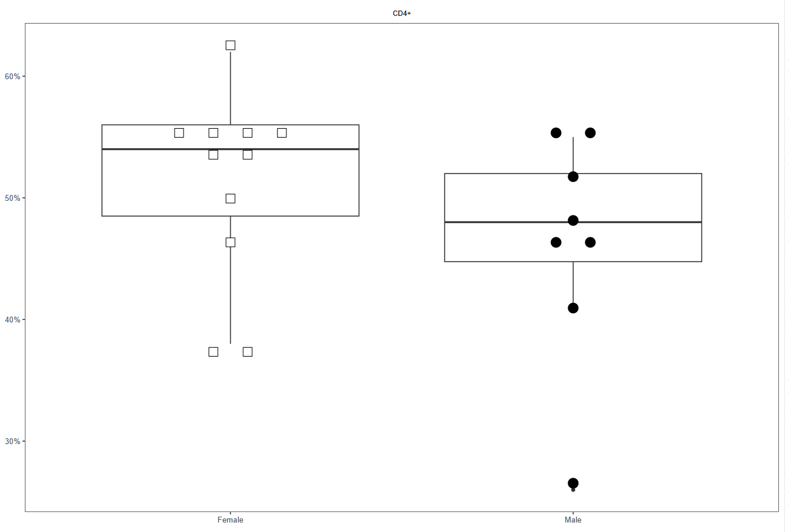
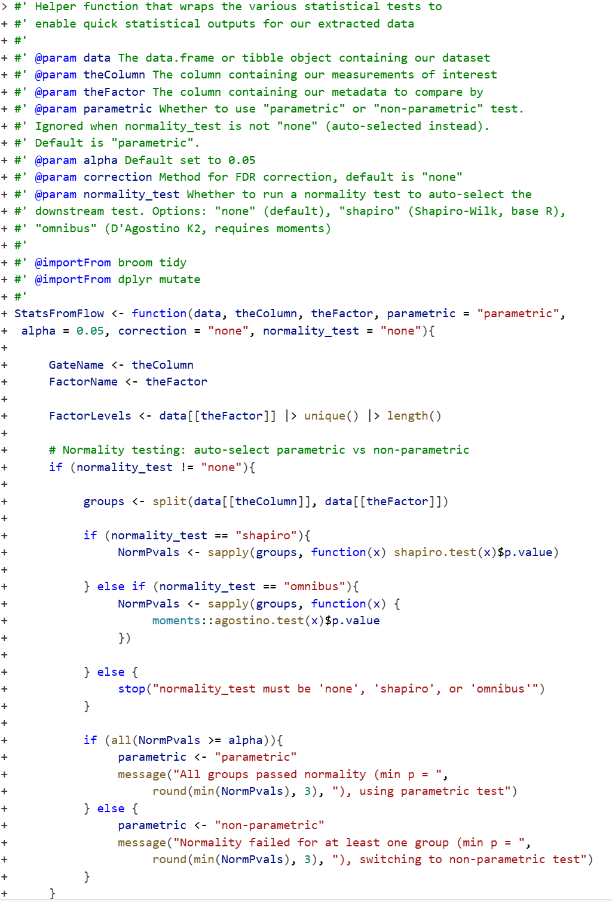
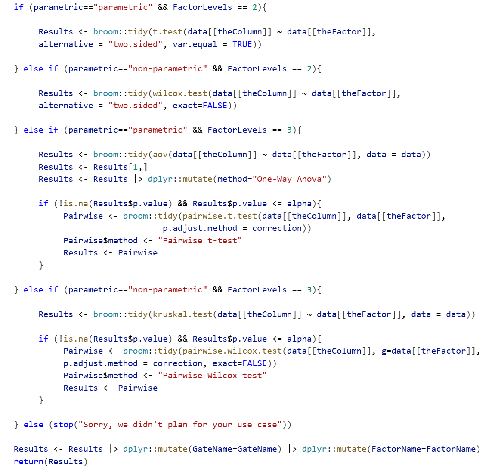
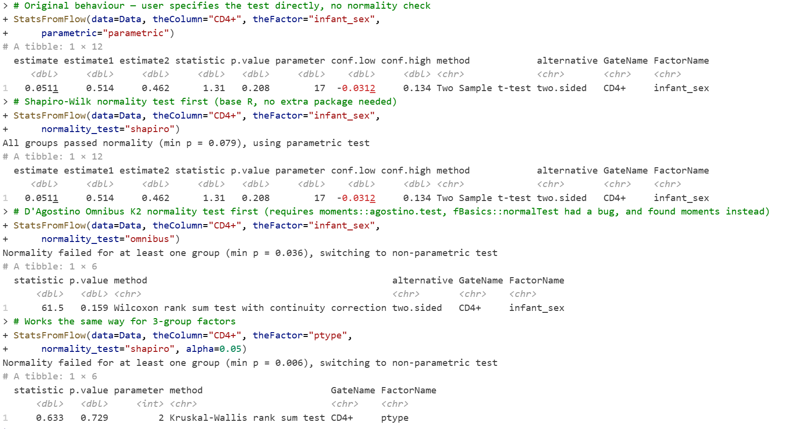

---
title:"Week 11 - Homework Lynn Kisselbach
format: pdf
---

# Problem 1

Implement additional openCyto gates, and validate that they are being placed correctly using Utility_GatingPlot(). Update the gate_range arguments until satisfied. Then, add new gates, and run the resulting dataset through CombinedFlow(), screenshotting any values that return with p-values that upon visualizing the data also look reasonable (not driven by a single-outlier).

# Answer 1

New gates added with T cell as the parent population: IFNg, TNFa, IL-2 and CD107a

Plots with p-values <0.1 for each new population

# Problem 2

In our ggbeeswarm boxplot, currently we are seeing the proportion on the y-axis. Figure out how to modify the StatPlotsForFlow() function to instead display the axis as a percentage, and then using additional function arguments and conditions, set the function up to allow you to switch between as desired. Also, externalize size and cex to modify your beeswarm boxplots in an easier fashion!

# Answer 2

Code and plots to show the y-axis as proportion vs percentage and adjusted size and cex values

# Problem 3

Some “typical” immunology workflows run a “normality” test before implementing a corresponding downstream test based on the result (Your friendly-neighbourhood statistician may have some strong thoughts on this field practice). Regardless of your position on this approach, see if you can modify our StatsFromFlow() function, using additional arguments conditional statements, to incorporate in a shapiro-wilks or fBasics package Omnibus K2 test first, and based on the outputs proceed downstream to either the parametric or non-parametric options

# Answer 3

